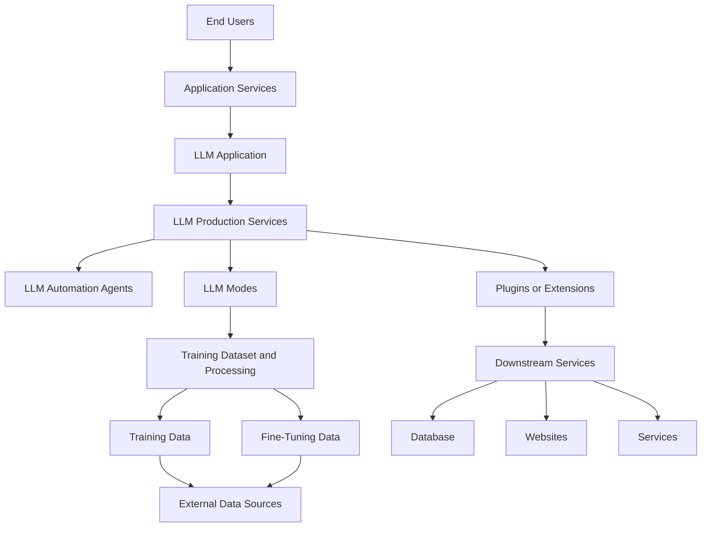





- Prompt Injection
- Jailbreak e.g DAN (Do/Say Anything Now, )
- Defense -- Guardrails / AI Firewalls / -- Garak scanner for AI

- [Red Team Strategy - Johann's Blog](https://embracethered.com/blog/)
- [OWASP Top 10 for LLM Applications](https://genai.owasp.org)
- [Getting Started with AI CTFs](https://www.youtube.com/watch?v=hnNZoHoyYpE)
- [Real-world Attacks on LLM Applications](https://www.youtube.com/watch?v=_4Q980G4ZXI)
- [ChatGPT for Red Teams](https://github.com/NetsecExplained/chatgpt-your-red-team-ally)
- [Attacking and Defending Generative AI](https://github.com/NetsecExplained/Attacking-and-Defending-Generative-AI)
- [AI Vulnerability Database](https://avidml.org)
- 
